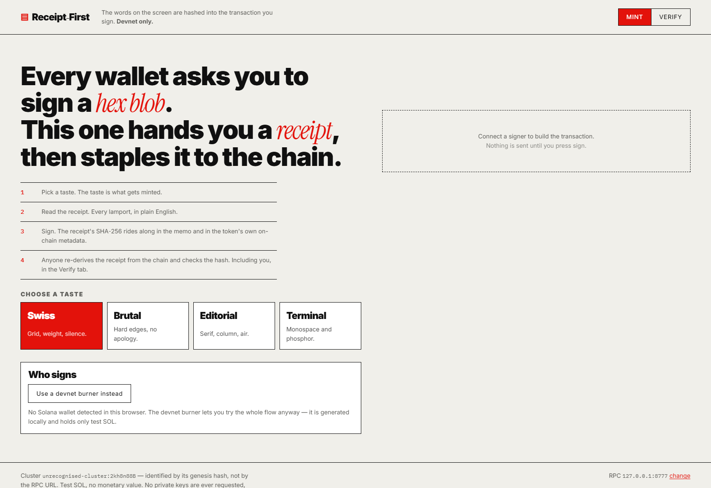
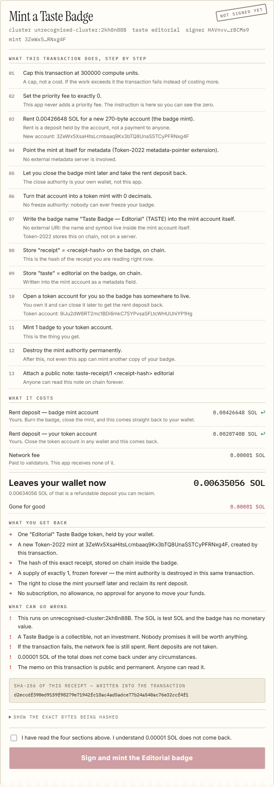
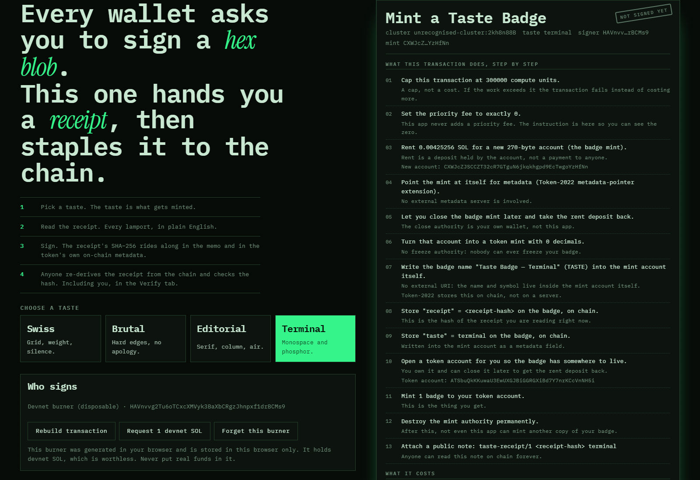
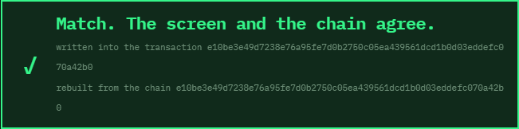

# Receipt-First

**The disclosure you read before signing is hashed into the transaction you sign — and anyone can check it afterwards.**

Solana devnet. Built for the [Proof of Taste](https://hackalaunch.com/h/proof-of-taste) hackathon,
where the brief is that the on-chain mechanic and the design should be the same thing.

**▶ Live app: <https://valeemlbb-cell.github.io/hackalaunch-proof-of-taste/>** — no install, no
wallet required (there is a burner button), devnet only. It refuses to build a transaction against
mainnet at all.



---

## The idea in one paragraph

Wallets show you a transaction you cannot read, and apps show you marketing copy next to it. If the
two disagree, you find out afterwards and have no way to prove what you were shown. Receipt-First
decodes the transaction it is about to ask you to sign, renders it as a plain-English receipt —
every instruction, every lamport, what you get, what can go wrong — and then **hashes that receipt
and writes the hash into the transaction itself**, twice: once as a memo, once as a field in the
badge's own Token-2022 metadata.

Afterwards, anybody can fetch the confirmed transaction, re-derive the receipt from its
instructions with the same code, hash it, and compare. Match means the screen and the chain agreed.
That check is built into the app's **Verify** tab, and it does not trust the app's memory of
anything — only the transaction.



**The proudest design choice:** the receipt is not a summary of the transaction, it is an input to
it. Change one sentence of the disclosure and the hash changes, so the transaction you sign is
literally a different transaction. Honest copy is enforced by the cryptography rather than by
good intentions.

---

## What it actually does on chain

Minting a Taste Badge is one transaction with thirteen instructions, all of them decoded on screen
before you sign:

| # | Instruction | Why it is there |
|---|---|---|
| 1–2 | Compute budget: unit limit, **unit price 0** | So the receipt can prove the priority fee is zero rather than assert it |
| 3 | System `createAccount` | The mint account. The receipt's rent figure is read out of this instruction |
| 4 | Token-2022 `InitializeMetadataPointer` | Mint points at itself — no metadata server exists to rug later |
| 5 | Token-2022 `InitializeMintCloseAuthority` | Close authority is **you**, so the rent deposit is reclaimable |
| 6 | Token-2022 `InitializeMint` (0 decimals, no freeze authority) | Nobody can ever freeze your badge |
| 7 | Token Metadata `Initialize` | Name and symbol, stored in the mint account |
| 8 | Token Metadata `UpdateField` → `receipt` | **The receipt hash, on chain, inside the token** |
| 9 | Token Metadata `UpdateField` → `taste` | The taste you picked |
| 10 | Associated Token Account `Create` | Somewhere for the badge to live |
| 11 | Token-2022 `MintTo` (amount 1) | The thing you get |
| 12 | Token-2022 `SetAuthority` → mint authority `None` | Supply is frozen at 1 in the same transaction |
| 13 | Memo | `taste-receipt/1 <sha256> <taste>` |

There is **no custom program**. Everything is Token-2022 plus its metadata extension, so there is no
upgrade authority anywhere in the picture that could change the rules after you signed.

### The taste is the mechanic



Four tastes — Swiss, Brutal, Editorial, Terminal — are not four accent colours. Each one moves
palette, type, border weight, radius, shadow and texture together, **and** changes the token that
lands in your wallet: its name, and its on-chain `taste` field. The receipt hash covers the taste,
so the look you chose is part of what you signed for.

---

## Programs and addresses

Nothing is deployed by this project. It composes existing programs:

| Program | Address | Cluster |
|---|---|---|
| Token-2022 | `TokenzQdBNbLqP5VEhdkAS6EPFLC1PHnBqCXEpPxuEb` | devnet |
| Associated Token Account | `ATokenGPvbdGVxr1b2hvZbsiqW5xWH25efTNsLJA8knL` | devnet |
| SPL Memo | `MemoSq4gqABAXKb96qnH8TysNcWxMyWCqXgDLGmfcHr` | devnet |
| System | `11111111111111111111111111111111` | devnet |
| Compute Budget | `ComputeBudget111111111111111111111111111111` | devnet |

Mint addresses are generated per badge — a fresh keypair each time — so there is no fixed mint to
list. The mint address appears in the receipt before you sign and in the Verify output afterwards.

**Cluster safety.** The app identifies the cluster by its **genesis hash**, never by the RPC URL.
Point it at mainnet-beta and it refuses to build a transaction at all. Point it at something it does
not recognise and the receipt says `unrecognised-cluster:<prefix>` instead of quietly claiming
devnet.

---

## Run it

```bash
npm install
npm run dev       # http://localhost:5173
npm test          # 59 tests
npm run build     # typecheck + production bundle into dist/
```

Requires Node 20+.

- **Wallet**: any Wallet Standard wallet that supports `solana:devnet` (Phantom, Solflare, Backpack).
- **No wallet?** Press *Use a devnet burner instead*. A keypair is generated in your browser,
  stored only in your browser, labelled disposable everywhere it appears, and it holds only test
  SOL. The app never asks anyone for a seed phrase or a private key.
- **Devnet SOL**: the in-app faucet button calls `requestAirdrop`, which is heavily rate-limited.
  If it refuses, use <https://faucet.solana.com> or set your own RPC with the *change* link in the
  footer. About **0.007 SOL** covers one badge, most of it a reclaimable rent deposit.

### Configuration

Copy `.env.example` to `.env` if you want a non-default RPC baked into the build. There are no
secrets in this project — no API keys, no server, no database, nothing to leak.

| Variable | Default | Meaning |
|---|---|---|
| `VITE_SOLANA_RPC` | `https://api.devnet.solana.com` | Devnet RPC endpoint |

The footer's *change* link overrides it per browser, stored in `localStorage` only.

---

## How the proof works

The receipt is hashed as canonical JSON: keys sorted, integers only, no timestamps, no locale
formatting. Every field it contains is recoverable from the confirmed transaction:

- the decoded instructions → from `compiledInstructions`
- the network fee → from the transaction's own `meta.fee`
- signer, mint, blockhash → from the message
- the taste → from the memo
- one rent constant → a pure function of an account size, asked of the cluster

Two parts are **redacted before hashing**: the memo and the `receipt` metadata field, because they
contain the hash itself. Everything else is bound. `tests/roundtrip.test.ts` builds a real
transaction, then rebuilds the receipt from the compiled transaction alone — sharing nothing with
the builder — and asserts the hashes agree, and that a one-lamport change breaks them.



An instruction the decoder does not recognise is **never** guessed at. It renders as a blocking
warning and the sign button cannot be enabled at all.

---

## Tests

```
tests/format.test.ts      number and address formatting that must never round a cost away
tests/canonical.test.ts   deterministic JSON + SHA-256 against published vectors
tests/cluster.test.ts     genesis-hash cluster identification, including "refuse mainnet"
tests/decode.test.ts      real SPL instructions in, plain English out; unknown data fails closed
tests/receipt.test.ts     hashing, redaction, cost totals, blocking behaviour
tests/roundtrip.test.ts   build -> compile -> rebuild from the transaction -> hashes match
```

`npm test` — 59 passing.

---

## Honest status

- Runs on devnet. The public devnet faucet was rate-limiting this machine's IP while the demo was
  recorded, so the recorded run used a **local `solana-test-validator`** — visible in the video,
  where the receipt honestly prints `unrecognised-cluster:…` instead of pretending to be devnet.
  The code path is identical; point it at devnet with SOL in the signer and it prints `devnet`.
- The demo voice-over uses the local Windows speech engine because the neural TTS host was
  unreachable from the build machine.
- There is no backend, no analytics, no telemetry, and no fee taken by this app anywhere.

---

## Pre-hackathon work

All application code in this repository — `src/`, `tests/`, `index.html`, the styles — was written
during the hackathon window for this hackathon. Nothing was imported from earlier projects.

`scripts/record_demo.py` reuses our team's existing approach to producing demo videos (drive the
real app in Playwright, record the page, generate a per-scene voice-over, mux with ffmpeg). The
approach is pre-existing; the script itself was written here and is specific to this app.

## AI-agent disclosure

This project was implemented by an AI coding agent (Anthropic's Claude, via Claude Code) working
from a human-written brief, under human direction and review. The agent wrote the code, the tests
and the copy, ran the test suite, drove the browser for the end-to-end run, and recorded the demo.
A human chose the concept, set the constraints (devnet only, no custom program, no secrets), and is
responsible for the submission.

## Licences

- This project: **MIT** — see [LICENSE](LICENSE).
- Fonts: Inter, Instrument Serif and IBM Plex Mono, all **SIL Open Font License 1.1**, loaded from
  Google Fonts.
- No third-party artwork. The favicon and the ✓/✗ marks are drawn from text and inline SVG written
  here.
- Dependencies: `@solana/web3.js`, `@solana/spl-token`, `@solana/spl-token-metadata` (Apache-2.0),
  `@wallet-standard/app` (Apache-2.0), `bs58` (MIT).

---

## Links

- **Live app: <https://valeemlbb-cell.github.io/hackalaunch-proof-of-taste/>** — deployed from
  `main` by [`.github/workflows/pages.yml`](.github/workflows/pages.yml), which runs
  `npm ci && npm test && npm run build` first, so a red test suite never reaches the live URL.
- **Repository: <https://github.com/valeemlbb-cell/hackalaunch-proof-of-taste>**
- Demo video: **`demo.mp4`** at the root of the packet folder is the one canonical cut — 1920×1080,
  2 min 30 s. The 720p copy beside it is the same cut, re-encoded only to fit upload size limits.
  The video is uploaded to X / YouTube for the submission form, so the file itself is deliberately
  not committed.
